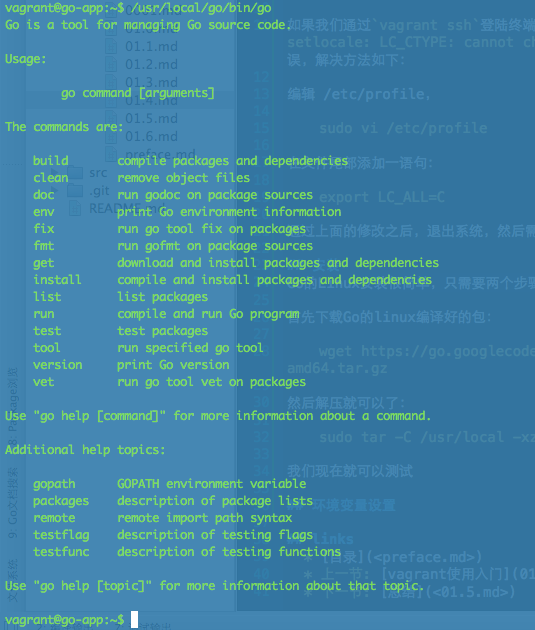

# 4 Go环境安装配置

前面我们已经安装好了虚拟环境，那么接下来就需要在虚拟环境中安装Go环境了，因此你首先要运行`vagrant up`把虚拟机开起来，然后通过`vagrant ssh`登录到系统中。

## Ubuntu环境设置
我们需要修改配置文件`/etc/default/locale`设置为：

	LANG="en_US.UTF-8"
	LANGUAGE="en_US:en"

如果我们通过`vagrant ssh`登录终端，按tab键出现`bash: warning: setlocale: LC_CTYPE: cannot change locale (zh_CN.UTF-8)` 的警告错误，解决方法如下：

编辑 /etc/profile，

	sudo vi /etc/profile

在文件尾部添加一句：

	export LC_ALL=C

通过上面的修改之后，退出系统，然后需要通过`vagrant reload`重启虚拟机.

## 安装
在Linux下安装Go很简单，只需要两个步骤：下载、解压。

首先下载Go的Linux编译好的包：

	wget https://storage.googleapis.com/golang/go1.4.2.linux-amd64.tar.gz

然后解压就可以了：

	sudo tar -C /usr/local -xzf go1.4.2.linux-amd64.tar.gz

我们现在就可以测试:

	/usr/local/go/bin/go

如果出现如下的界面，那么说明已经安装成功了。

## 环境变量设置
上面我们已经成功安装了Go，那么接下来我们配置一些Go开发需要的信息：`GOPATH`的设置(关于GOPATH的概念请到[https://github.com/astaxie/build-web-application-with-golang/blob/master/ebook/01.2.md](https://github.com/astaxie/build-web-application-with-golang/blob/master/ebook/01.2.md))。

上面我们已经知道Vagrant启动之后，会默认把Vagrant这个目录挂载到系统的`/vagrant`目录，因此我们设置`GOPATH`到该目录：

	$ cd
	$ mkdir /vagrant/gopath/
	$ vim .bashrc

切换到用户目录，打开bashrc进行设置，在最末尾增加如下两行：

	export GOPATH=/vagrant/gopath
	export PATH=$PATH:/usr/local/go/bin:$GOPATH/bin

设置完毕之后，执行`source`命令使其生效：

	$ source .bashrc

这个时候`GOPATH`设置成功，同时Go命令都已经加入了`PATH`，你在命令行下面执行如下：

	$ go env

就会成功显示如下信息：

	GOARCH="amd64"
	GOBIN=""
	GOCHAR="6"
	GOEXE=""
	GOHOSTARCH="amd64"
	GOHOSTOS="linux"
	GOOS="linux"
	GOPATH="/vagrant/gopath/"
	GORACE=""
	GOROOT="/usr/local/go"
	GOTOOLDIR="/usr/local/go/pkg/tool/linux_amd64"
	CC="gcc"
	GOGCCFLAGS="-g -O2 -fPIC -m64 -pthread"
	CGO_ENABLED="1"

至此所有的Go环境配置完成，你和你的小伙伴们一定被如此简单的配置惊呆了吧。

## links  
  * [目录](preface.md)
  * 上一节: [Vagrant使用入门](01.3.md)
  * 下一节: [总结](01.5.md)
