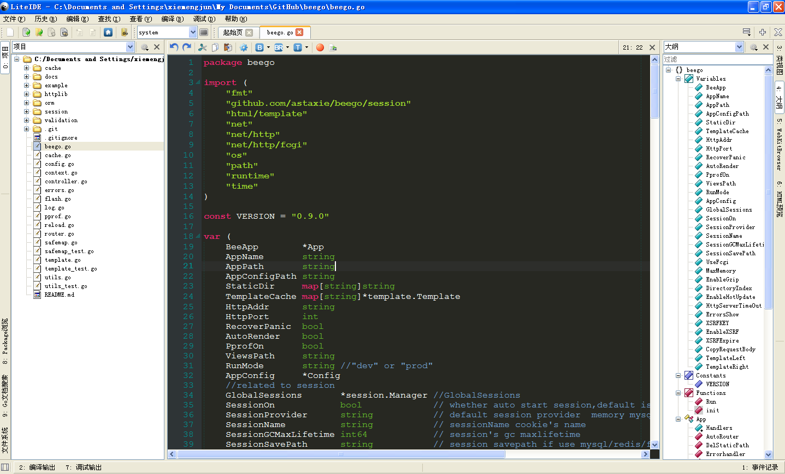
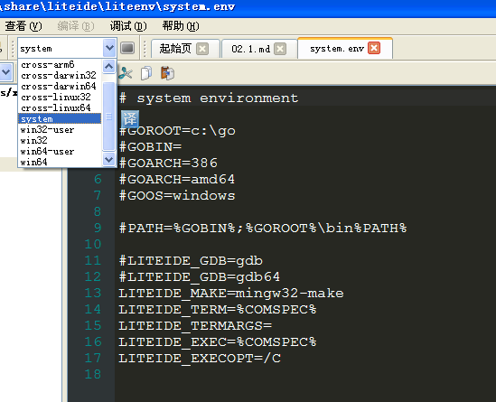
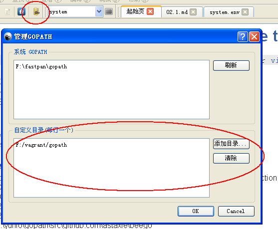

# 2.1 LiteIDE的安装和配置
前面介绍了LiteIDE是国内牛人基于QT框架开发的一款编辑器软件，目前已经迭代了十几个版本，功能也是越来越强大，不仅支持Go的开发，还支持lua开发、Markdown编写，以及支持将Markdown导出pdf等功能，接下来我将一一展现它的各种特性。

## 安装LiteIDE
LiteIDE依赖于Go语言命令，所以在LiteIDE安装之前你必须在HOST机上安装配置好Go，如何在不同的机器上面安装Go，请参考：https://github.com/astaxie/build-web-application-with-golang/blob/master/ebook/01.1.md 。

LiteIDE安装可以有两种方式：源码编译和二进制包安装。
- 源码编译

	LiteIDE的源码目前放在github上：https://github.com/visualfc/liteide ，如果你熟悉QT之类的语言，可以自己去编译一个版本，编译的过程大概是：下载QT包，然后执行源码下面的编译脚本。

- 二进制包安装

	我们大多数的时候直接下载编译好的二进制包就可以了。LiteIDE二进制包的下载地址为：http://code.google.com/p/golangide/downloads/list ，根据操作系统下载LiteIDE对应的压缩文件直接解压即可使用。

## 配置LiteIDE
一般情况下，只要你的开发机配置好了Go环境，LiteIDE打开就能用了，但是不排除有些情况打开无法使用，不过没有关系，LiteIDE可以进行个性化的设置，打开软件如下图所示：

默认情况下，LiteIDE会读取系统的环境变量，`GOPATH`、`GOROOT`这些参数都会读取到，但是如果真的读不到这些数据，我们可以通过如下的方式来设置,选择对应的系统，然后点击边上的命令行形状的按钮，出现如下图所示的系统`.env`配置文件，你就可以在这个文件里设置对应的配置信息了：

因为我们前一章介绍了在虚拟机环境下设置了Vagrant目录下的`GOPATH`为虚拟机的`GOPATH`，所以直接在我们开发机上的LiteIDE里面配置`GOPATH`就可以了，相当方便，如下图所示：

## LiteIDE开发项目

## 交叉编译

## links  
  * [目录](<preface.md>)
  * 上一节：[第二章介绍](02.0.md)
  * 下一节: [Sublime Text的安装和配置](02.2.md)
